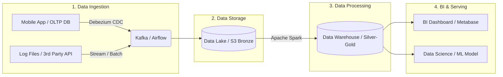

# Bài nộp Lab 01 - BIG DATA ENGINEER OVERVIEW

## Task 1. Mô tả vai trò của Data Engineer
Data Engineer (Kỹ sư dữ liệu) là người đóng vai trò xây dựng, duy trì và tối ưu hoá hạ tầng dòng chảy dữ liệu (data pipelines). Nhiệm vụ của họ bao gồm kết nối các nguồn dữ liệu đa dạng, tiến hành thu thập (ingest), làm sạch và biến đổi (transform), sau đó lưu trữ kết quả an toàn vào trung tâm phân tích (data platform). Nhờ có Data Engineer, dữ liệu được đảm bảo về chất lượng, tốc độ và luôn sẵn sàng để phục vụ cho các team downstream như BI, Data Analyst hay Data Scientist phân tích.

## Task 2. Ví dụ Use Case: OLTP vs OLAP
*   **OLTP (Online Transaction Processing - Xử lý giao dịch hàng ngày):**
    1.  Hệ thống xử lý thao tác giỏ hàng và thanh toán trên ứng dụng thương mại điện tử (Shopee, Tiki) khi khách hàng bấm mua hàng.
    2.  Hệ thống kiểm tra số dư và chuyển khoản trên app Mobile Banking nội bộ yêu cầu cao về tính nhất quán dòng tiền từng milisecond.
*   **OLAP (Online Analytical Processing - Xử lý phân tích đa chiều):**
    1.  Chạy báo cáo tổng hợp để so sánh doanh thu và chi phí chuỗi cửa hàng trong 5 năm gần nhất cung cấp cái nhìn vĩ mô bằng Dashboard.
    2.  Hệ thống phân tích rủi ro tín dụng hoặc chống giả mạo bằng cách lướt quét file log chứa mẫu hành vi của hàng chục triệu khách hàng trong quá khứ.

## Task 3. Vì sao Data Lake phù hợp với Big Data và Machine Learning?
Data Lake vô cùng lý tưởng cho Big data và Machine Learning trên hai phương diện chính:
*   Độ linh hoạt: Dựa trên kiến trúc "Schema-on-read", Data Lake linh hoạt cho phép lưu thẳng tất cả định dạng dữ liệu từ có cấu trúc (bảng DB) tới bán cấu trúc và cả phi cấu trúc (text, video, clickstreams logs rác...) mà không cần xây dựng trước mô hình. 
*   Bảo toàn nguyên bản dữ liệu: Dữ liệu chưa filter chính là món ăn tốt nhất cung cấp độ sâu (features context lớn) cho Data Scientist tạo ra những model ML có độ chính xác cao. Kèm với năng lực scaling gần như bất tận của việc lưu trữ (Object Storage như S3) giúp duy trì chi phí lưu trữ lớn rất tối ưu.

## Task 4. Sơ đồ Data Pipeline tổng quát


## Task 5. Local PostgreSQL Container
Dưới đây là text terminal mô phỏng kết quả dòng lệnh sau khi khởi tạo và chạy PostgreSQL trên Docker ở môi trường Local:
```text
Thuy@lakehouse-stack % docker ps | grep postgres
CONTAINER ID   IMAGE                 COMMAND                  STATUS                 PORTS                                             NAMES
3bfaf48e10f8   postgres:15           "docker-entrypoint.s…"   Up 5 hours (healthy)   0.0.0.0:5434->5432/tcp, [::]:5434->5432/tcp       de_airflow_db
26bb5f700c0e   postgres:15           "docker-entrypoint.s…"   Up 5 hours             0.0.0.0:5432->5432/tcp, [::]:5432->5432/tcp       de_postgres
```
*(Hiện tại Database PostgreSQL đã được map thành không gian local thông qua port 5432 và sử dụng client UI có thể connect thoải mái).*
